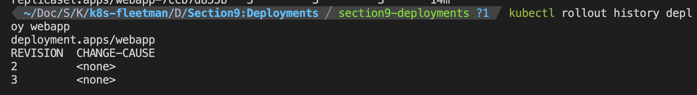

# Deployments
### 1. Deployment will create replicasets, two replicasets, if version changes.


## Note you will always need to run 
```
kubectl port-forward svc/fleetman-webapp 30080:80
```
## in minikube.


## 2. Rollout history:

```
kubectl rollout undo deploy webapp
```



## 3. When you want to rollback to previous version

```
kubectl rollout history deploy app
```

## or to a specific version

```
kubectl rollout history deploy app --to-revision=2
```


# 4. But remember only to do rollback in the case of really an emergency, because you need to keep the image version consistent with the living running environment with the yaml file. 

## so keep that in mind that whenever you've done a rollback, you need to make sure that the image in the yaml file stayed consistent with the living running environment.