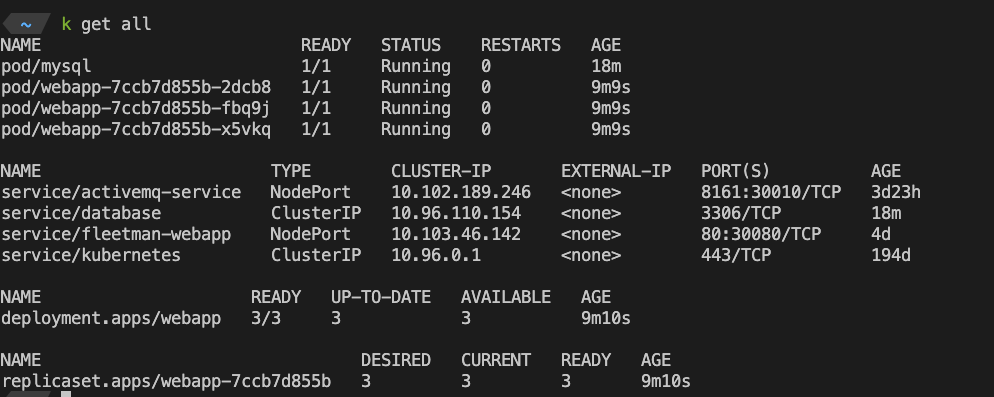

# Table of Contents
1. [Networking and Service Discovery in Kubernetes](#networking-and-service-discovery-in-kubernetes)
   - [Kubernetes DNS service: 'kube-dns' and 'coreDNS'](#kubernetes-dns-service-kube-dns-and-coredns)
   - [Navigating namespaces and pods in Kubernetes](#navigating-namespaces-and-pods-in-kubernetes)
2. [Service Discovery](#service-discovery-1)
   - [Example of service discovery using an example script](#example-of-service-discovery-using-an-example-script)
   - [Understanding how service discovery works within a web-app](#understanding-how-service-discovery-works-within-a-web-app)
   - [Looking up "database" from the dnscore](#looking-up-the-database-from-the-dnscore)
3. [Shortening "kubectl" to "k"](#shortening-kubectl-to-k)
   - [Creating and using an alias for the kubectl command](#creating-and-using-an-alias-for-the-kubectl-command)

# Networking and Service Discovery in Kubernetes
## Service Discovery
Question: How do we networking containers together?
Ip addresses are dynamically allocated by Kubernetes. The next time we run the k8s cluster, there will probably be different IP addressed allocated to the servies.

## The fact that K8s maintains its own private DNS service, it's basically a dictionary containing a set of key-value pairs. We don't need to configure or maintain this DNS system.

### 1.  The serivce is called 'kube-dns'
 It's in the "kube-system" namespace though.
 * A namespace is a way to partitioning your resources in kubernetes into separate areas.

### 2. The way to show the namespaces
```
    kubectl get ns
``` 

### 3. get pods inide a specific namespace:
```
kubectl get po -n kube-system
```

The corendns is the dns service that k8s manages service discovery.


Use this describe command plus the specific namespace to see what's inside coredns.

```
kubectl describe deployment coredns -n kube-system
```

# Service Discovery
##  If you're running a Mac M1, then you can use the image "mysql/mysql-server:8.0.23"

1. The example script to help demonstrate the service discovery is in networking-tests.yaml

    first run 

    ```
    kubectl apply -f networking-tests.yaml
    ```

2. To deploy the service, this will create a pod running MySQL database.

    Now there are 3 web-app pods running in the same cluster with the mysql database.
    

        I now then go into one of the web-app pod:

    ```
    kubectl exec -it webapp-7ccb7d855b-2dcb8 sh
    ```
    

3. Now you are inside the pod "webapp-7ccb7d855b-2dcb8"  Since this app is running on the alpine linux (see the docker image details0).. we will try to connect to mysql from this container

    But first we need to understand how the web-app discover the mysql ip:

    in webapp run:

    ```
    vi /etc/resolv.conf
    ```
    ### chatgpt: "The /etc/resolv.conf file is a configuration file found in Unix-like operating systems, including Linux. It is used to specify the DNS (Domain Name System) resolver configuration for the system. The DNS resolver is responsible for converting human-readable domain names (like www.example.com) into IP addresses (like 192.0.2.1) that computers can understand."

    You will see result:

    

4. Next, in the kube-system namespace, if you get all
    ```
    kubectl get all -n kube-system
    ```

    ## The coredns ip is the same as what we see in step 3!
    

    # So the web-app pod will lookup "database" from the dnscore to find the exact ip address in the cluster to connect to.

5. Do a nslookup in the webapp, and in the cluster, get the ip for mysql database, you will find it the same.
```
nslookup database
```

```
kubectl get all
```


----------------------------------------------------------------------------------------------------


## the way to shorten "kubectl" to "k"
You can create an alias for `kubectl` command to `k` for your convenience.

On a Unix-like system such as Linux or MacOS, you can add the alias to your shell profile. Depending on your shell, this file could be `~/.bashrc`, `~/.bash_profile`, or `~/.zshrc` if you're using the Zsh shell. 

To add the alias, open your shell profile file in a text editor and add the following line:

```bash
alias k=kubectl
```

Save the file and then source your profile to make the alias available in your current shell. For example, if you added the alias to `~/.bashrc`, you would run:

```bash
source ~/.bashrc
```

Now you can use `k` instead of `kubectl` in your terminal.

Remember, this alias will be available only in the terminal where you sourced the profile. If you open a new terminal window or tab, you would need to source the profile again, or close and reopen your terminal. To make this alias permanent and available in all future terminal sessions, you will have to add the alias command line to your shell's startup script (`~/.bashrc`, `~/.bash_profile`, or `~/.zshrc` etc. depending on your shell).