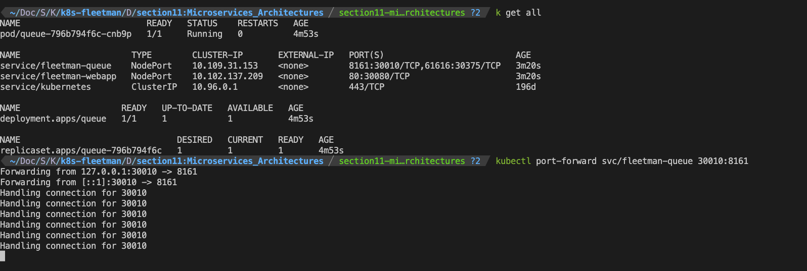
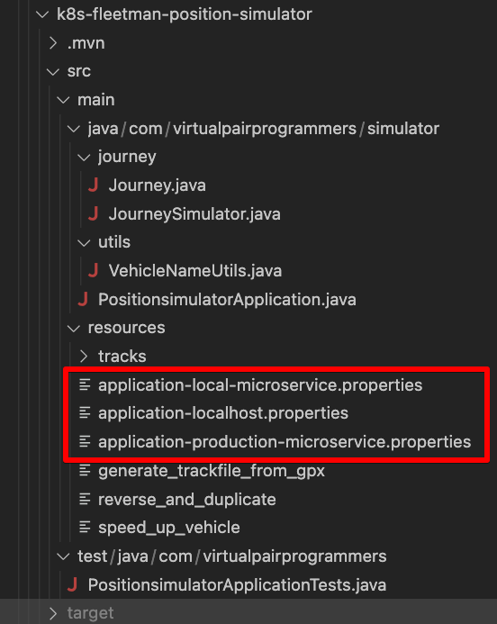
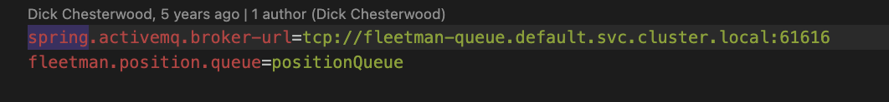
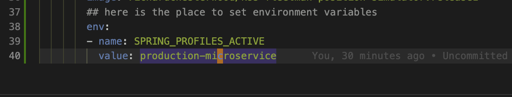
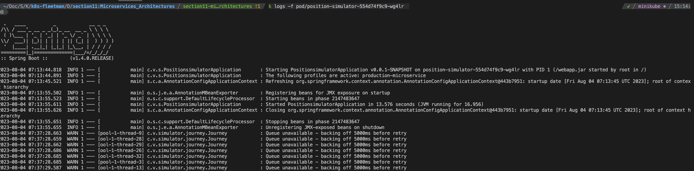
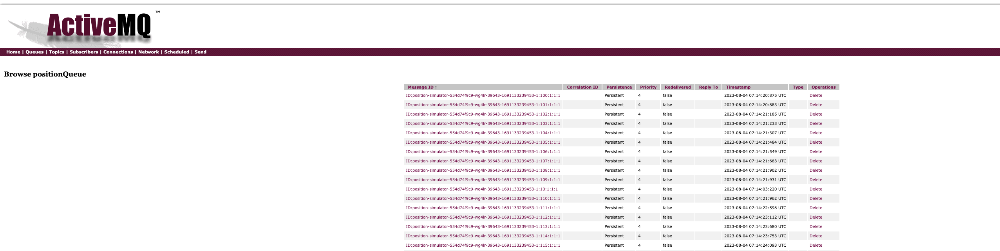
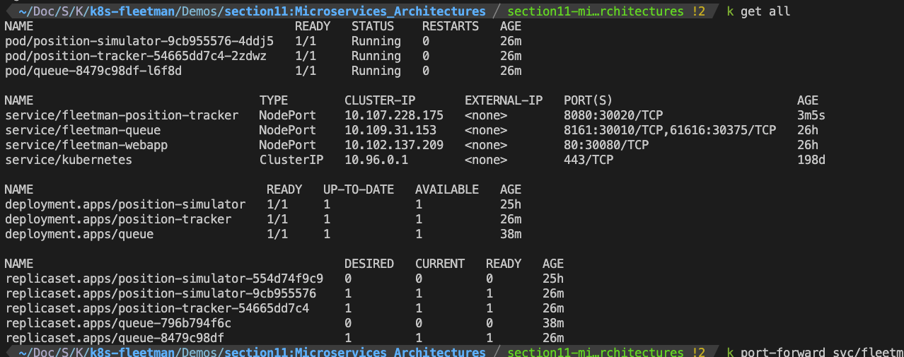
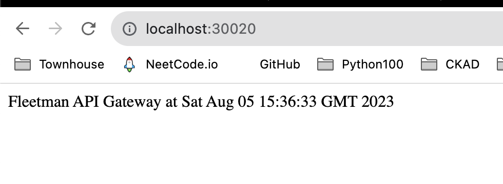

# An Introduction to MicroServices.

## Side Notes

The kill_docker.sh is a script used to kill all the processes containing the keyword "docker".
Because I had some problems restarting the docker desktop on my macOs, so I wrote the script and to execute it, please read the other README file.
[Demos/section11:Microservices_Architectures/README_kill_docker.md](README_kill_docker.md)


## 1. Jeff Bezo's Two-Pizza Team Rule

Jeff Bezos, the founder of Amazon, introduced the "Two-Pizza Team" rule as a way to manage the size and efficiency of teams within the company. The rule states that any team should be small enough that it can be fed with two pizzas.

## 2. High Cohension and Loose Couple 高内聚低耦合

Single Responsiblity of a microservice is key, and also well defined interfaces are important. Nested dependencies are dreadful.

## 2. Each microservies, will maintain its own datastore.

Instead of using a single, integrated database that contains all the integration of tables and data schemas.

<span style="color:red"> **Each microservice will maintain its own dataStore!!!** <span>

==================================

# Deploy the microservices:

## 1. Deploy the queue

 #### a. first is to create deployment for ActiveMq, in case the queue crashes, it will auto-healing and it will be easy to upgrade.

The context resides in workloads.yaml

```
kubectl apply -f workloads.yaml
```

Then deploy the webapp service
```
kubectl apply -f services.yaml
```

#### b. In minikube, in order to see it in localhost, run the port-forwarding command:

```
 kubectl port-forward svc/fleetman-queue 30010:8161 
```

Go to http://localhost:30010/

Use "admin" as username and password to sign in.

### 2. Deploy the position-simulator microservice.

#### a. The position-simulator is a service without a RESTful API interface to tell it what to do. It simply sends message to the ActiveMQ, nothing else.


#### b. In the source code, inside JourneySimulator.java:


```java
	public void run() 
	{
		try 
		{
			this.runVehicleSimulation();
		} 
		catch (InterruptedException e) 
		{
			Thread.currentThread().interrupt();
		}
	}

	/**
	 * For each vehicle, a thread is started which simulates a journey for that vehicle. 
	 * When all vehicles have completed, we start all over again. 
	 * @throws InterruptedException 
	 */
	public void runVehicleSimulation() throws InterruptedException 
	{
		Map<String, List<String>> reports = setUpData();
		threadPool = Executors.newCachedThreadPool();		
		boolean stillRunning = true;
		while (stillRunning)
		{
			List<Callable<Object>> calls = new ArrayList<>();

			for (String vehicleName : reports.keySet())
			{
				// kick off a message sending thread for this vehicle.
				calls.add(new Journey(vehicleName, reports.get(vehicleName), template, queueName));
			}
			
			threadPool.invokeAll(calls);
			if (threadPool.isShutdown())
			{
				stillRunning = false;
				System.out.println("Asked to finish!");
			}
		}
	}
```

The above code defines how the threadpool is used to kick off a message sending thread for the vehicle to the queue.

Then in the program entry (PositionsimulatorApplication.java), it starts the simulation from there(mainThread.start()):
```java
@SpringBootApplication
public class PositionsimulatorApplication {

	public static void main(String[] args) throws IOException, InterruptedException 
	{
		try(ConfigurableApplicationContext ctx = SpringApplication.run(PositionsimulatorApplication.class))
		{
			final JourneySimulator simulator = ctx.getBean(JourneySimulator.class);

			Thread mainThread = new Thread(simulator);
			mainThread.start();
		}
		
	}

}
```

#### c. The environment varaibles are needed to determine which resources .properties file to use.

For example in "application-production-microservice.properties":


The environment variable is specified in deployment part of the position-simulator in workloads.yaml


Now from the chatGpt, it says the spring.activemq.broker-url is configured in the jmsTemplate object, however I failed to find where exactly were it configured, need further exploration.

#### d. deploy the new workloads.yaml then you should see the pod running, if no typos.
```
k get all
```

```
k logs -f pod/position-simulator-554d74f9c9-wg4lr  
```

inspecting the logs from the position-simulator container


And don't forget to port-forward the fleetman-queue, if you want to see the messages in the queue from localhost:

```
kubectl port-forward svc/fleetman-queue 30010:8161 
```
in localhost:30010 you should see a bunch of messages already sent to queue.


### 3. Deploy the fleetman-position-tracker

#### a. created the deployment in workloads.yaml file. Change the container name to what they should be using, although you could see that usually the container's name doesn't really matter that much, even if you missed that.

```
kubectl apply -f workloads.yaml
```

After the deployment is done, you could check to see that the messages in the activeMQ is gone(it cumulated 200+ in previous step).

#### b. craete a new service called fleetman-position-tracker, in the services.yaml file.
The port number to expose is 8080, this is usually the port a service is designed to listen to, type is NodePort at first try.

```
kubectl apply -f services.yaml
```

You should see service running by now


#### c. After the service being deployed, don't forget to port forward for minikube to work locally.

```
kubectl port-forward svc/fleetman-position-tracker 30020:8080
```


#### d. go http://localhost:30020 you should see "white label error". It's good cause apache is runing .

then you go to http://localhost:30020/vehicles/City%20Truck , it should give you the exact location of a city truck for testing purpose


#### e. We then change the nodePort type to clusterIp, for the service to work within the cluster and to be isolated from the outside cluster.


### 4. Deploy api-gateway

#### a. This step is just normal, get to make changes in workloads.yaml and service.yaml, add another deployment and another service for api-gateway in these two files, and use 

```
kubectl apply -f workloads.yaml
kubectl apply -f services.yaml
```
since we've made the api-gateway as nodePort for now. 

when you use port-forward for it to work in minikube:

```
kubectl port-forward svc/fleetman-api-gateway 30020:8161
```

GO to http://localhost:30020/ 
You should see the time and Fleetman API Gateway:

